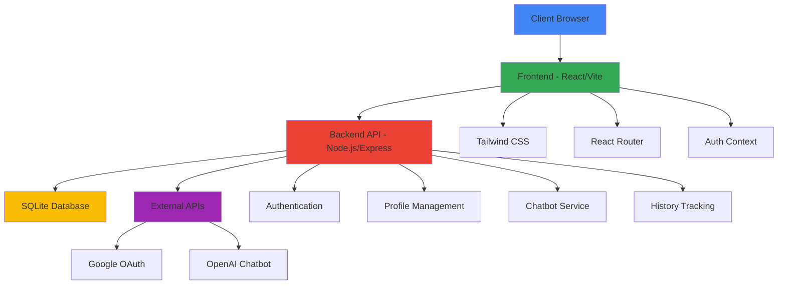
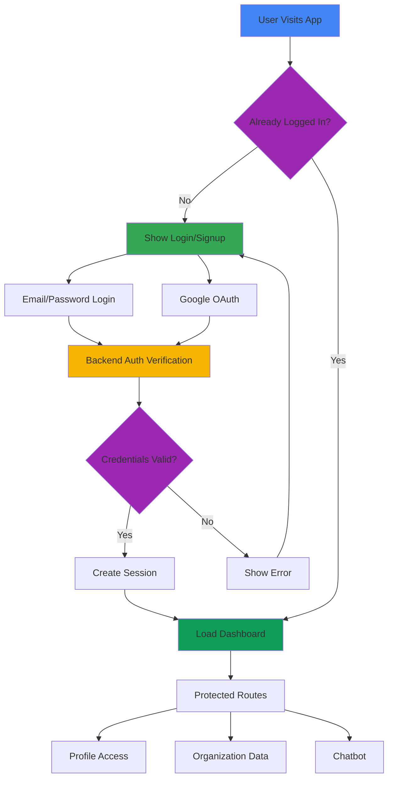
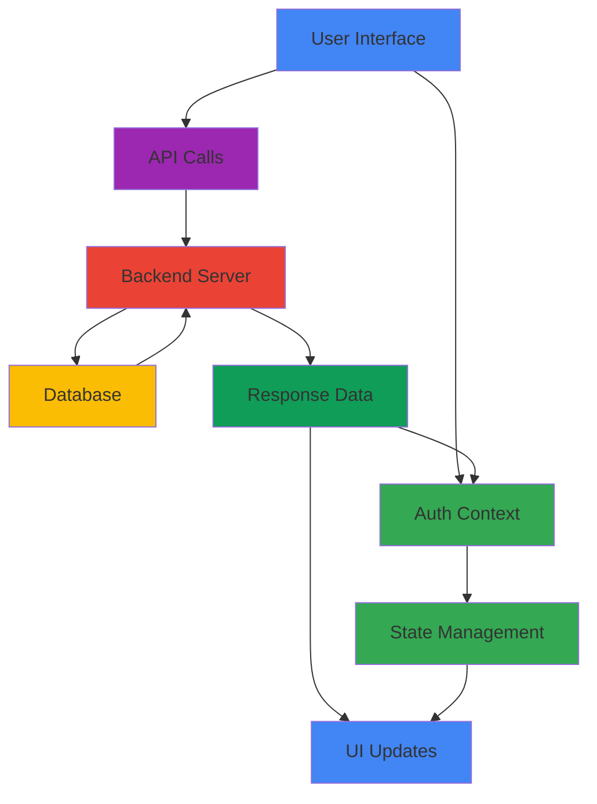
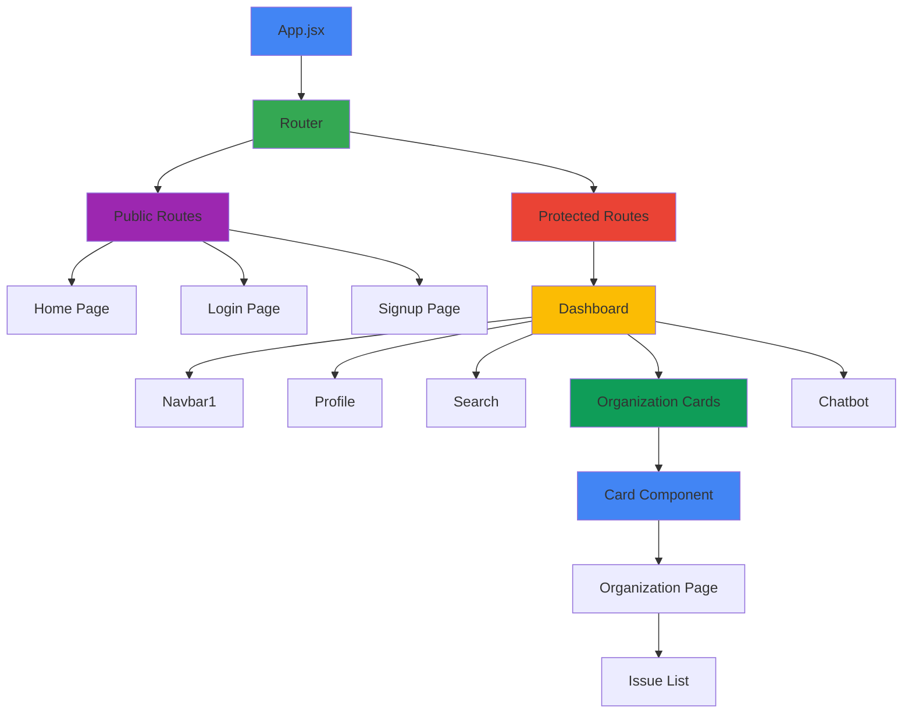

# DevHub

A modern web application for developers featuring user authentication, profile management, organization tracking, and AI-powered assistance.

## Table of Contents
- [Features](#features)
- [Technology Stack](#technology-stack)
- [Project Structure](#project-structure)
- [Architecture Diagram](#architecture-diagram)
- [Authentication Flow](#authentication-flow)
- [Data Flow](#data-flow)
- [Component Structure](#component-structure)
- [Authentication System](#authentication-system)
- [Profile Management](#profile-management)
- [Organization & Issue Tracking](#organization--issue-tracking)
- [UI Components](#ui-components)
- [Backend Architecture](#backend-architecture)
- [Environment Variables](#environment-variables)
- [Setup and Installation](#setup-and-installation)

## Features

- **User Authentication**: Email/password and Google OAuth login
- **User Profiles**: Avatar upload, bio, social links
- **Organization Management**: Track organizations and their issues
- **Dark/Light Theme**: Toggle between color schemes
- **AI Chatbot**: Get assistance with development questions
- **Responsive Design**: Works on desktop and mobile devices

## Technology Stack

### Frontend
- **React 18** - UI library
- **Vite** - Build tool and development server
- **Tailwind CSS** - Styling framework with dark mode support
- **React Router DOM v6** - Client-side routing
- **Lucide React** - Icon library

### Backend
- **Node.js** - JavaScript runtime
- **Express** - Web framework
- **SQLite** - Database with better-sqlite3
- **Session Management** - Express-session with SQLite store

### Authentication
- **JWT** - Token-based authentication
- **bcryptjs** - Password hashing
- **Google OAuth 2.0** - Third-party authentication

## Project Structure

```
.
├── server/                 # Backend server
│   ├── auth.js            # Authentication endpoints
│   ├── profile.js         # Profile management endpoints
│   ├── db.js              # Database operations
│   ├── chatbot.js         # AI chatbot integration
│   ├── history.js         # Navigation history tracking
│   └── index.js           # Server entry point
├── src/                   # Frontend source code
│   ├── components/        # Reusable UI components
│   ├── context/           # State management (AuthContext)
│   ├── pages/             # Route-level components
│   ├── utils/             # Helper functions
│   ├── App.jsx            # Main application component
│   └── main.jsx           # Entry point
└── public/                # Static assets
    └── uploads/
        └── avatars/       # User uploaded profile pictures
```

## Architecture Diagram



## Authentication System

The authentication system is managed through `AuthContext.jsx` which provides state across the entire application.

### Key Files:
- `src/context/AuthContext.jsx` - Centralized authentication state management
- `src/components/ProtectedRoute.jsx` - Route protection component
- `src/pages/Login.jsx` - Login page with form validation
- `src/pages/SignUp.jsx` - User registration page
- `src/pages/AuthCallback.jsx` - Google OAuth callback handler

### Where Authentication is Used:
1. **Route Protection**: Protected routes redirect unauthenticated users to login
2. **User State**: Maintains user session across page navigation
3. **API Calls**: Automatically includes credentials with backend requests
4. **UI Elements**: Profile menu and logout functionality

## Authentication Flow



## Profile Management

### Key Files:
- `src/components/Profile.jsx` - Profile display in dashboard
- `src/pages/ProfileSettings.jsx` - Profile editing interface
- `server/profile.js` - Backend profile endpoints

### Features:
1. **Avatar Upload**: Users can upload profile pictures
2. **Profile Information**: Username, bio, location
3. **Social Links**: GitHub, LinkedIn, Instagram, Website
4. **Data Persistence**: Changes saved to backend database

## Data Flow



## Organization & Issue Tracking

### Key Files:
- `src/components/Card.jsx` - Organization cards
- `src/components/IssueList.jsx` - Issue display component
- `src/pages/OrganizationPage.jsx` - Detailed organization view
- `src/components/data.js` - Mock organization data

### Features:
1. **Organization Cards**: Display organizations with issue counts
2. **Issue Tracking**: Open/closed issue management
3. **Search Functionality**: Find organizations and issues
4. **Pagination**: Navigate through large datasets

## Component Structure



## UI Components

### Navigation:
- `src/components/Navbar.jsx` - Public site navigation
- `src/components/Navbar1.jsx` - Dashboard navigation with theme toggle

### Forms:
- `src/components/FormInput.jsx` - Standardized form inputs
- `src/components/Button.jsx` - Consistent button styling
- `src/components/ErrorMessage.jsx` - Error display component

### Layout:
- `src/components/Layout.jsx` - Consistent page structure
- `src/components/Chatbot.jsx` - AI assistant interface

## Backend Architecture

### Key Modules:
1. **auth.js** - User registration, login, session management
2. **profile.js** - Profile CRUD operations, avatar upload
3. **db.js** - Database interactions with better-sqlite3
4. **chatbot.js** - OpenAI integration for AI assistance
5. **history.js** - Navigation tracking

### Security Features:
- Password hashing with bcrypt
- Session management with secure cookies
- CORS configuration for frontend communication
- Input validation and sanitization

## Environment Variables

### Frontend (.env):
```
VITE_API_URL=http://localhost:5000
```

### Backend (.env):
```
JWT_SECRET=your-secret-key-change-this-in-production
PORT=5000
SESSION_SECRET=your-session-secret-change-this
GOOGLE_CLIENT_ID=your-google-client-id-here
GOOGLE_CLIENT_SECRET=your-google-client-secret-here
FRONTEND_URL=http://localhost:5173
OPENAI_API_KEY=your-openai-api-key-here
```

## Setup and Installation

1. **Install Dependencies**:
   ```bash
   # Frontend
   npm install
   
   # Backend
   cd server
   npm install
   ```

2. **Configure Environment Variables**:
   - Copy `.env.example` to `.env` in both root and server directories
   - Update values with your own credentials

3. **Run Development Servers**:
   ```bash
   # Frontend (from root directory)
   npm run dev
   
   # Backend (from server directory)
   npm run dev
   ```

4. **Build for Production**:
   ```bash
   # Frontend
   npm run build
   ```

The application will be available at:
- Frontend: http://localhost:5173
- Backend API: http://localhost:5000